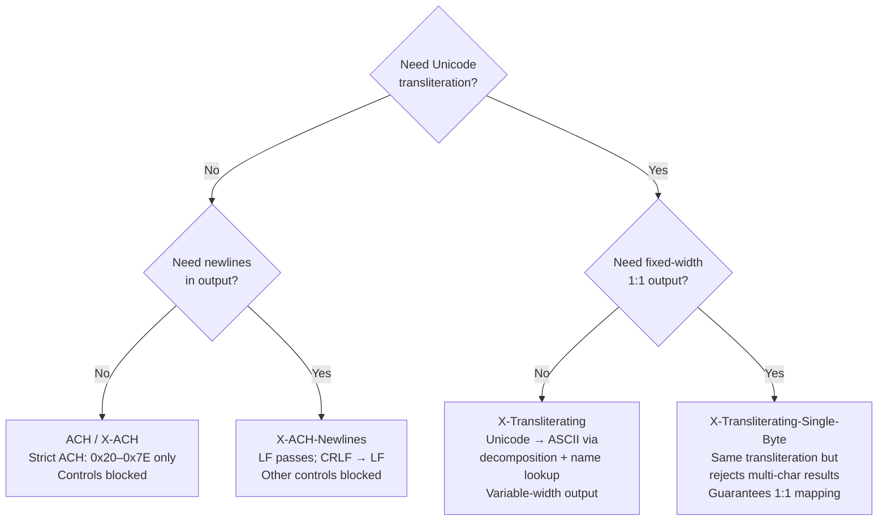
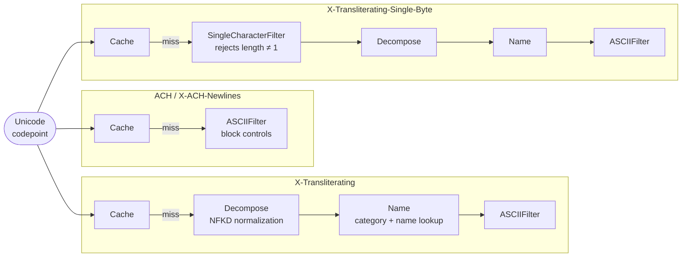
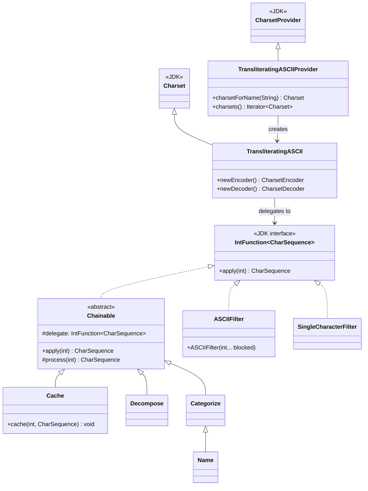

# ACH-safe Charset

A Java `Charset` SPI provider that encodes Unicode text into the ACH-safe subset of ASCII.
Rather than simply rejecting non-ASCII input, the transliterating variants map common Unicode
characters — accented letters, curly quotes, em-dashes — to their nearest ASCII equivalents,
making it practical to process real-world input without aborting the ACH file.

## Links

- [GitHub repository](https://github.com/bhanafee/ACHCharset)
- [Javadoc](https://bhanafee.github.io/ACHCharset/javadoc/)
- [Apache 2.0 License](https://bhanafee.github.io/ACHCharset/LICENSE)
- [Code of Conduct](https://bhanafee.github.io/ACHCharset/CODE_OF_CONDUCT.html)
- [Claude Code Guidance](https://bhanafee.github.io/ACHCharset/CLAUDE.html)

## The Problem

ACH (Automated Clearing House) files are restricted to printable US-ASCII characters
(`0x20`–`0x7E`). Applications that generate ACH output from real-world data inevitably encounter
names with accented characters, Unicode punctuation (em-dashes, curly quotes), or EBCDIC newline
variants from mainframe sources. Java's standard charsets handle this poorly: they either throw a
`CharacterCodingException` or silently substitute `?`, both of which can corrupt the fixed-width
record format that ACH processing depends on.

This library provides ACH-specific charsets that transliterate rather than reject or blindly
replace, and that handle ACH's edge cases — newline variants and control characters — correctly.

## Features

- **SPI-based**: registered as a `CharsetProvider`, so `Charset.forName("ACH")` works without
  any code changes to existing `InputStreamReader` / `OutputStreamWriter` usage
- **Safe replacement by default**: unexpected characters become `?` rather than throwing
- **Optional newlines**: `X-ACH-Newlines` passes LF and normalises CRLF to LF
- **Unicode transliteration**: `X-Transliterating` maps accented letters, punctuation, and common
  Unicode symbols to ASCII equivalents using NFKD decomposition and name-based lookup
- **Fixed-width mode**: `X-Transliterating-Single-Byte` guarantees 1:1 character output, which
  is essential for ACH's 94-character record format
- **Cached**: repeated codepoints are served from an in-memory cache rather than re-running the
  transliteration pipeline

## Requirements

- Java 17 or higher (Java 21 toolchain used for compilation)

## Installation

The library is published to GitHub Packages. Add the repository and dependency to your
`build.gradle`:

```groovy
repositories {
    maven {
        url = uri("https://maven.pkg.github.com/bhanafee/ACHCharset")
        credentials {
            username = project.findProperty("gpr.user") ?: System.getenv("GITHUB_ACTOR")
            password = project.findProperty("gpr.key") ?: System.getenv("GITHUB_TOKEN")
        }
    }
}

dependencies {
    implementation 'com.maybeitssquid:achcharset:1.0.0'
}
```

Or build from source:

```bash
./gradlew build
```

## Charset Variants

Four charsets are provided. Choose based on whether you need newline support and whether you need
Unicode transliteration:



All charsets are retrieved by name because the SPI provider is registered on the classpath:

```java
Charset ach          = Charset.forName("ACH");
Charset achNewlines  = Charset.forName("X-ACH-Newlines");
Charset xliterate    = Charset.forName("X-Transliterating");
Charset xliterateSB  = Charset.forName("X-Transliterating-Single-Byte");
```

## Transliterator Pipeline

The two strict ACH charsets use a minimal pipeline (`Cache → ASCIIFilter`). The transliterating
charsets add decomposition and name-based lookup stages:



Each step implements `IntFunction<CharSequence>` and delegates to the next on a cache miss.
Processing is driven right-to-left during construction but left-to-right at runtime:

| Stage | Class | What it does |
|---|---|---|
| Cache | `Cache` | Returns cached result for known codepoints; populates on first miss |
| SingleCharacterFilter | `SingleCharacterFilter` | Rejects any result whose length ≠ 1, ensuring fixed-width output |
| Decompose | `Decompose` | Applies NFKD normalisation; skips codepoints below U+00A0 |
| Name | `Name` | Matches LATIN LETTERs, brackets, and punctuation by `Character.getName()` |
| ASCIIFilter | `ASCIIFilter` | Passes `0x20`–`0x7E`; rejects blocked Unicode categories |

## Class Structure



## Newline handling

Although the ACH specification does not allow values below `0x20` or above `0x7F`, there are some
exceptions implemented by this library:

| Codepoint | Character | ACH / X-ACH | X-ACH-Newlines | Notes |
|---|---|---|---|---|
| `0x0A` | Linefeed | Blocked | Allowed | Common record separator in ACH implementations |
| `0x0D` | Carriage return | Blocked | Normalised to `""` | CRLF → LF on all platforms; `canEncode(0x0D)` returns `false` |
| `0x7F` | DEL | Blocked | Blocked | Unprintable control character |
| `0x85` | NEL | Encoded as LF | Encoded as LF | EBCDIC newline; safe to encode, unsafe to decode (see below) |

The `CRLF` sequence is encoded and decoded as `LF` on all platforms.

`0x85` (NEL, the EBCDIC newline) is encoded as a linefeed because the character is unambiguously
a Unicode newline. Decoding a `0x85` byte is not safe: in UTF-8 it would be a continuation byte
of a multibyte sequence; in Windows-1252 it is a horizontal ellipsis (…); in ISO-8859-1 it is
undefined. The decoder therefore does not map `0x85`.

## Disallowed character handling

Java `Charset` can be configured for one of three different actions when it encounters an error
encoding or decoding a character:

1. **Report** — throws a `CharacterCodingException`
2. **Replace** — substitutes a predefined placeholder (default: `?` for encoding, `�` for decoding)
3. **Ignore** — omits the character, producing shorter output

The default is **Replace**. ACH files have a fixed-width record format, so **Ignore** risks
shifting subsequent fields. **Report** halts processing on the first bad character. **Replace**
(the default) keeps the file structure intact and flags the substitution for downstream review.

## Examples

### Decoding an `InputStream` to a `Reader`

#### Length-preserving reads of an ACH input stream

An input stream that is expected to contain only characters allowed by ACH may encounter an
unexpected value. Reporting the error with an exception could abort the entire file ingestion
stage due to a single field on a single record. Ignoring the error by skipping over the
unexpected character may cause an offset that breaks subsequent processing of a fixed-width field.
The best approach may be to substitute a replacement character into the stream and allow
processing to continue. Using a Unicode replacement character (&#xFFFD;) is the default action
for a Java `Charset`.

```java
InputStream bytesIn = new FileInputStream("input.ach");
// Charset can be passed by name because it has a provider resource in the classpath
Reader reader = new InputStreamReader(bytesIn, "ACH");
// Reader will replace unexpected bytes with the Unicode replacement character
```

#### Forcing failure if the input contains unexpected characters

If an input stream that is expected to contain only characters allowed by ACH encounters an
unexpected value, it can be configured to report the error with an exception. This prevents
missing or replacement characters being passed, which ensures that only completely clean inputs
continue processing. This is not the default action for a Java `Charset`, so the behavior must
be configured by modifying the `Decoder`.

```java
InputStream bytesIn = new FileInputStream("input.ach");
// Retrieve Charset by name because it has a provider resource in the classpath
Charset ACH = Charset.forName("ACH");
// Obtain an explicit decoder and override the default behavior on malformed input
CharsetDecoder decoder = ACH.newDecoder().onMalformedInput(CodingErrorAction.REPORT);
// Use the constructor that accepts a CharsetDecoder
Reader reader = new InputStreamReader(bytesIn, decoder);
// Reader will throw an exception if it encounters an unexpected byte
```

### Encoding an `OutputStream` to a `Writer`

#### Length-preserving writes to an ACH output stream

ACH files require each record to be 94 characters. The critical fields necessary for processing a
file are usually generated by well-tested templates. A template may include text fields from a
source that contains a wider range of characters than ACH allows. Injecting an unexpected
character could cause problems for downstream systems. Reporting the error with an exception could
abort and delay the entire file generation stage due to a single field on a single record. The
best solution in this case is to replace the unexpected character with a replacement. Replacing
the offending character with the encoder's default replacement is the default action for a Java
`Charset`. The default replacement is a question mark (?).

```java
OutputStream bytesOut = new FileOutputStream("output.ach");
// Charset can be passed by name because it has a provider resource in the classpath
Writer writer = new OutputStreamWriter(bytesOut, "ACH");
// Writer will replace unexpected characters with '?'
```

#### Forcing failure if the output contains unexpected characters

If a single bad character is considered sufficient cause to abort generation of an ACH file, the
encoding can be configured to throw an exception rather than continuing. This is not the default
action for a Java `Charset`, so the behavior must be configured by modifying the `Encoder`.

```java
OutputStream bytesOut = new FileOutputStream("output.ach");
// Retrieve Charset by name because it has a provider resource in the classpath
Charset ACH = Charset.forName("ACH");
// Obtain an explicit encoder and override the default behavior on unmappable output
CharsetEncoder encoder = ACH.newEncoder().onUnmappableCharacter(CodingErrorAction.REPORT);
// Use the constructor that accepts a CharsetEncoder
Writer writer = new OutputStreamWriter(bytesOut, encoder);
// Writer will throw an exception if it encounters an unexpected character
```
